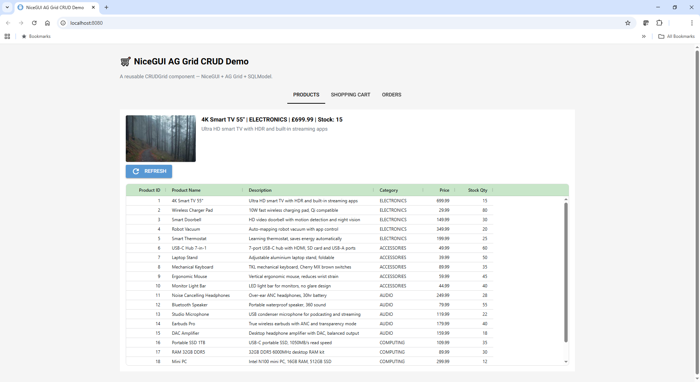

# nicegui-aggrid-crud

A reusable CRUD grid component for [NiceGUI](https://nicegui.io/) built on
[AG Grid](https://www.ag-grid.com/) and [SQLModel](https://sqlmodel.tiangolo.com/).

The goal is to document — through a working demo — the non-obvious wiring
required to make NiceGUI 3.x and AG Grid 34.x play nicely together, including
several traps that cost significant debugging time and are not covered in either
project's documentation.

---

## Overview

The core of the project is a single reusable class, `CRUDGrid`, which wires an
AG Grid instance to a SQLModel table with minimal boilerplate. It handles column
generation, dirty-cell tracking, row selection, inline editing, dropdown editors,
date/time auto-fill on double-click, and a configurable toolbar — all from a
single constructor call.

The demo wraps `CRUDGrid` in three subclasses to show progressively more complex
patterns across three tabs:

<div align="center">
  
</div>

| Tab | Demonstrates |
|-----|-------------|
| **Products** | Fully read-only grid, `on_row_selected` driving `ui.image` + `ui.label` |
| **Shopping Cart** | Full CRUD, auto-commit on product select, client-side price lookup, dirty-cell tracking |
| **Orders** | Two delivery patterns: double-click auto-save and status dropdown with server-side side-effects, cross-tab navigation |

---

## Quick Start

**Requirements:** Python 3.11+, pip

```bash
git clone https://github.com/ahsot/nicegui-aggrid-crud.git
cd nicegui-aggrid-crud
pip install -r requirements.txt
```

Seed the database and run:

```bash
python -c "from example.database import init_db; init_db(start_afresh=True)"
python -m example.main
```

Open [http://localhost:8080](http://localhost:8080).

To reset to clean seed data at any time:

```bash
python -c "from example.database import init_db; init_db(start_afresh=True)"
```

---

## Project Structure

```
nicegui-aggrid-crud/
├── example/
│   ├── components/
│   │   ├── crud_grid.py      # ← the reusable component
│   │   ├── columns.py        # ← auto-generates AG Grid column defs
│   │   └── formatters.py     # ← fixes JSON round-trip type loss
│   ├── grids/
│   │   ├── product_grid.py   # demo subclass — read-only
│   │   ├── cart_grid.py      # demo subclass — full CRUD
│   │   └── order_grid.py     # demo subclass — lifecycle events
│   ├── models.py             # SQLModel tables (Product, ShoppingCart)
│   ├── services.py           # data access functions
│   ├── database.py           # engine + seed data
│   └── main.py               # NiceGUI entry point
├── db/                       # SQLite database (git-ignored)
├── tests/
└── requirements.txt
```

---

## The Three Tabs

### Products — read-only catalogue

```python
ProductGrid(
    image_display      = product_image,
    detail_label       = product_name_label,
    detail_description = product_desc_label,
).build()
```

- `submit_row=None` makes the grid fully read-only — no NEW, UPDATE or DELETE
  buttons are rendered
- Clicking a row fires `on_row_selected()` which updates a `ui.image` and two
  `ui.label` components outside the grid
- The first row is auto-selected on page load so the image panel is never empty

### Shopping Cart — full CRUD

- **ADD ITEM** inserts a blank row; selecting a product from the dropdown
  auto-commits the row immediately (no SAVE needed for new items)
- **unit_price** and **total_value** are recalculated server-side — the browser
  value is never trusted
- **total_value** is updated in the DOM immediately via `run_javascript()` when
  quantity changes, before a SAVE is triggered
- **CHECKOUT ITEM** auto-saves any dirty rows first, then moves the item from
  `WISHLIST` → `PAID` and the row disappears from the cart view
- Dirty cells are highlighted in amber; each grid instance has its own scoped
  JavaScript `Set` so grids on the same page do not bleed highlight state into
  each other

### Orders — lifecycle events

All PAID and DELIVERED items appear here (non-WISHLIST rows from ShoppingCart).

Two patterns for marking an order as delivered are demonstrated side by side:

**Pattern 1 — double-click `delivered_time`:**
The column is immutable so no cell editor opens. The double-click is treated as
a deliberate "mark as delivered" gesture. `deliver_order()` is called server-side
and the timestamp is written directly into the DOM cell via `run_javascript()`
without waiting for a full grid refresh.

**Pattern 2 — status dropdown → DELIVERED:**
The status column has a `agSelectCellEditor` dropdown showing PAID and DELIVERED.
Changing to DELIVERED calls `deliver_order()` and updates the `delivered_time`
cell immediately. Attempting any other transition (e.g. DELIVERED → PAID) is
blocked server-side and the dropdown reverts in the DOM.

**Cross-tab navigation:**
Double-clicking the `Product ID` cell in Orders switches to the Products tab
and scrolls to and highlights the matching product row.

---

## CRUDGrid Component

### Constructor

```python
CRUDGrid(
    table_model,          # SQLModel class — drives column auto-generation
    load_rows,            # Callable[[], list[dict]] — data source
    submit_row,           # Callable[[dict], Any] | None — None = read-only
    delete_row   = None,  # Callable[[dict], Any] | None
    pre_submit_hook = None,  # transform row dict before submit
    dropdown_map  = None, # {"field_name": ["option1", "option2", ...]}
    excluded_fields = None,  # omit from grid entirely
    hidden_fields   = None,  # in rowData but not visible
    immutable_fields = None, # visible but not editable
    new_row_defaults = None, # default values for blank new rows
    header_colour = "#d6d6d6",
    height        = "600px",
    label_new     = "NEW",    # None = hide button
    label_upload  = "UPLOAD", # None = hide button
    label_delete  = "DELETE", # None = hide button
)
```

### Subclassing hooks

Override these methods in a subclass for domain-specific behaviour:

```python
class MyGrid(CRUDGrid):

    def on_row_selected(self, row: dict) -> None:
        """Called on every row click. Drive linked ui.image / ui.label here."""
        self._my_label.set_text(row.get("name", ""))

    def extra_toolbar_buttons(self) -> None:
        """Add domain-specific buttons after the standard toolbar buttons."""
        ui.button("MY ACTION", icon="star", on_click=self._my_action)
```

### Read-only grids

Pass `submit_row=None` to suppress NEW and UPDATE buttons entirely:

```python
CRUDGrid(
    table_model = Product,
    load_rows   = load_product_rows,
    submit_row  = None,   # read-only — no toolbar edit buttons
)
```

### Hiding individual toolbar buttons

Pass `None` for any label to suppress that button while keeping the others:

```python
CRUDGrid(
    ...
    label_new    = None,    # hide NEW button
    label_upload = None,    # hide UPDATE button — useful for event-driven grids
    label_delete = "REMOVE",
)
```

This is useful for grids where edits are triggered by domain events (dropdown
changes, double-clicks) rather than an explicit SAVE button.

---

## Using CRUDGrid in Your Own Project

Three files form the portable core of this project. Copy them into your own
codebase as-is — they have no demo-specific dependencies:

| File | What it does | Action |
|------|-------------|--------|
| `example/components/crud_grid.py` | The reusable grid component | **Copy** |
| `example/components/columns.py` | Builds AG Grid column defs from SQLModel | **Copy** |
| `example/components/formatters.py` | Fixes JSON round-trip type loss | **Copy** |

The remaining files are demo-specific and should be replaced with your own:

| File | What it does | Action |
|------|-------------|--------|
| `example/models.py` | SQLModel table definitions | **Replace** with your own models |
| `example/services.py` | Data access functions | **Replace** with your own services |
| `example/database.py` | SQLite engine + seed data | **Replace** with your DB setup |
| `example/grids/*.py` | Demo subclasses | **Use as reference**, write your own |
| `example/main.py` | Demo NiceGUI page | **Use as reference**, write your own |

### Minimal usage — no subclass needed

```python
from components.crud_grid import CRUDGrid
from myapp.models import Customer
from myapp.services import load_customers, save_customer, delete_customer

# Full CRUD grid in one call
CRUDGrid(
    table_model = Customer,
    load_rows   = load_customers,
    submit_row  = save_customer,
    delete_row  = delete_customer,
).build()
```

### What `columns.py` does for you

`generate_column_defs_from_table()` inspects your SQLModel class and
automatically:

- Sets `editable=False` on primary key fields
- Applies `agSelectCellEditor` to fields in `dropdown_map`
- Formats `_time` and `_date` fields with appropriate value formatters
- Right-aligns numeric columns
- Inserts UI-only display columns (e.g. `product_name` next to `product_id`)
  adjacent to their FK counterpart

### What `formatters.py` does for you

AG Grid serialises all row data through JSON before sending it to Python. This
causes silent type loss:

| DB type | After JSON round-trip | `cast_row_types` fix |
|---------|----------------------|---------------------|
| `Decimal` | `float` | `Decimal(str(value))` |
| `int` | `float` | `int(value)` |
| `datetime` | ISO string | `datetime.strptime(...)` |
| `date` | ISO string | `date.fromisoformat(...)` |

`cast_row_types(row, MyModel)` is called automatically by `upload_all()` before
each row is passed to `submit_row`.

---

## NiceGUI 3.x + AG Grid 34.x Gotchas

These are the non-obvious behaviours encountered during development. They are
documented in the source code comments and summarised here for reference.

### 1. `onCellValueChanged` is intercepted by NiceGUI

You cannot attach a JavaScript callback to `onCellValueChanged` via the
`{"function": "..."}` wrapper — NiceGUI intercepts it for its own internal event
system. Use `grid.on("cellValueChanged", handler)` to receive the event in Python
instead.

### 2. `onGridReady` is owned by NiceGUI

NiceGUI registers its own `onGridReady` handler internally. Adding a second one
causes `"originalOnGridReady is not a function"`. Never add `onGridReady` to
`gridOptions`.

### 3. `cellClassRules` uses bare variables

AG Grid evaluates `cellClassRules` expression strings with `node`, `column`,
`value`, `data`, and `rowIndex` as bare variables — **not** as `params.node` /
`params.column`. Using `params.*` throws a `ReferenceError`.

```python
# Correct
"cellClassRules": {"my-class": "node.rowIndex === 0"}

# Wrong — params is not defined here
"cellClassRules": {"my-class": "params.node.rowIndex === 0"}
```

### 4. `{"function": "..."}` only works at the top level of `gridOptions`

The `{"function": "..."}` NiceGUI wrapper evaluates JavaScript at the top level
of `gridOptions` (e.g. `onCellValueChanged`) but **does not work** inside nested
column definition properties such as `cellClassRules` or `valueFormatter`. Use
plain expression strings or the colon-prefix `:key` form instead.

```python
# Correct — colon prefix triggers JS evaluation
col[":valueFormatter"] = "params => params.value || ''"

# Wrong — plain string is not evaluated as JS
col["valueFormatter"] = "params => params.value || ''"
```

### 5. `rowClicked` causes a circular JSON serialisation error

AG Grid's `rowClicked` event object contains internal references (`context`,
`beans`) that cannot be serialised to JSON, causing a server error. Use
`cellClicked` instead and read only `rowIndex` from `e.args`.

### 6. `firstDataRendered` re-fires on every `grid.update()`

`firstDataRendered` is not a true "once on load" event in NiceGUI — it re-fires
every time `grid.update()` is called. Guard any one-time setup with a boolean
flag.

```python
def _on_first_data_rendered(self, _):
    if not self._autofitted:
        self._autofitted = True
        # one-time setup here
```

### 7. `getRowId` cannot be set via NiceGUI syntax

Setting `getRowId` in `gridOptions` via any NiceGUI syntax breaks row creation.
Use `grid.update()` instead of `applyTransaction` for row model updates.

### 8. `window.__dirtykeys__` bleeds across multiple grids

If you have more than one AG Grid on the same page and use a global JS variable
for dirty-cell tracking, all grids will share the same state and highlight each
other's cells. Fix: generate a unique JS variable name per grid instance.

```python
_uid = uuid.uuid4().hex[:8]
self._dirty_js_name = f"__dirtykeys_{_uid}__"
```

### 9. Updating non-editable cell content

For cells where `editable=False` (e.g. `_time` / `_date` fields, or immutable
fields updated as a server-side side-effect), the AG Grid row model update path
is not reliably accessible from NiceGUI's JS context. Write directly to the
cell's DOM `textContent` via `run_javascript()` instead.

```python
ui.run_javascript(f"""
    document.querySelectorAll('.ag-row[row-index="{row_index}"]')
        .forEach(function(r) {{
            const cell = r.querySelector('[col-id="{col_id}"]');
            if (cell) {{
                const v = cell.querySelector('.ag-cell-value');
                if (v) v.textContent = '{new_value}';
            }}
        }});
""")
```

### 10. Always use `json.dumps()` when injecting Python strings into JS

Raw f-string interpolation breaks when values contain quotes or special
characters (e.g. a product named `4K Smart TV 55"`). Always escape via
`json.dumps()`:

```python
safe_val = json.dumps(str(value))
ui.run_javascript(f"myElement.textContent = {safe_val};")
```

---

## Requirements

```
nicegui>=3.0.0
sqlmodel>=0.0.16
```

---

## Licence

MIT — see [LICENSE](LICENSE).